# YouthStudy3.0
基于YouthStudy2.0修改了一些bug和更新了学院管理员身份等功能

# =====================================

# ===============  使用方法  ===============

# =====================================

## 第一步：录入账号 (  团支书、老师、学院管理员  )

### 一、录入团支书账号

#### ①准备一个存有学生信息的excel文件

第一列：学号

第二列：姓名

第三列：邮箱(如果不想使用邮箱提醒功能，可以为空)

##### 如下图所示：

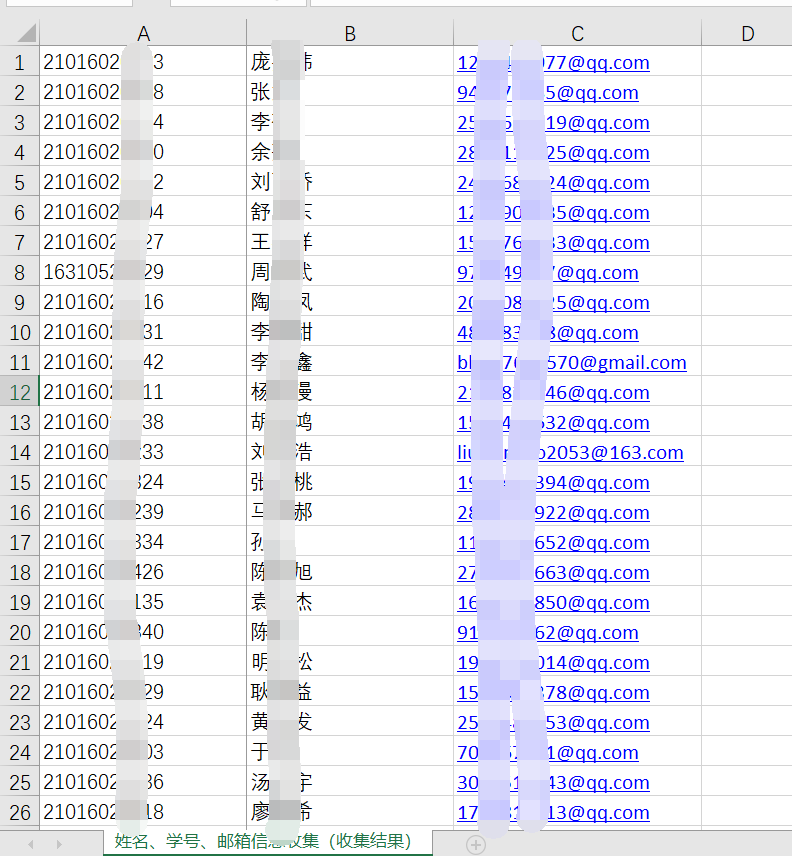

#### ②第一次运行软件如下图所示，按照下图操作。

可以提前在[青年大学习后台管理系统 (scyol.com)](https://dxx.scyol.com/dxxBackend/#/login)上登录测试一下账号和密码，确保可以登录成功再进行如下步骤。

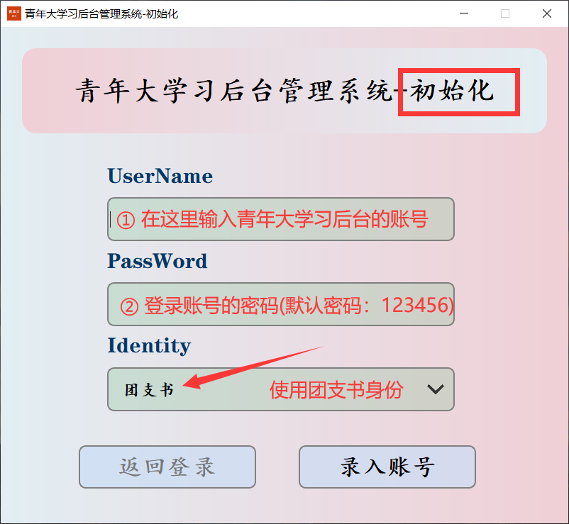

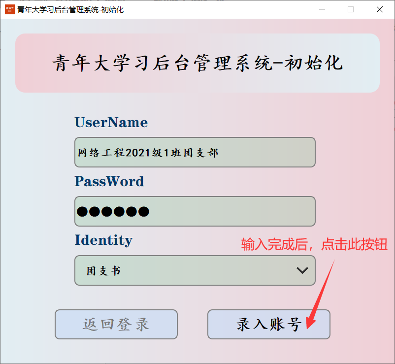

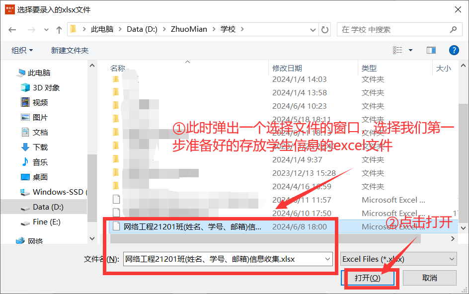

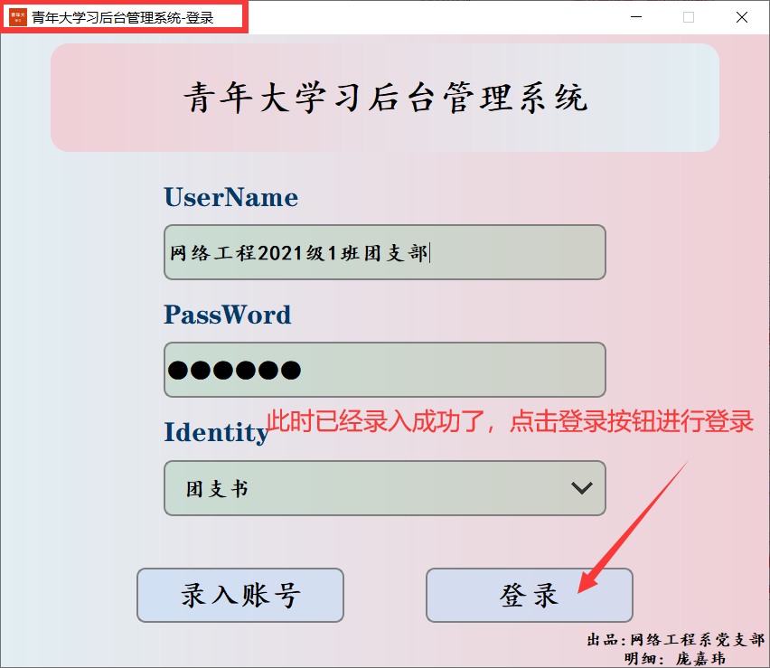

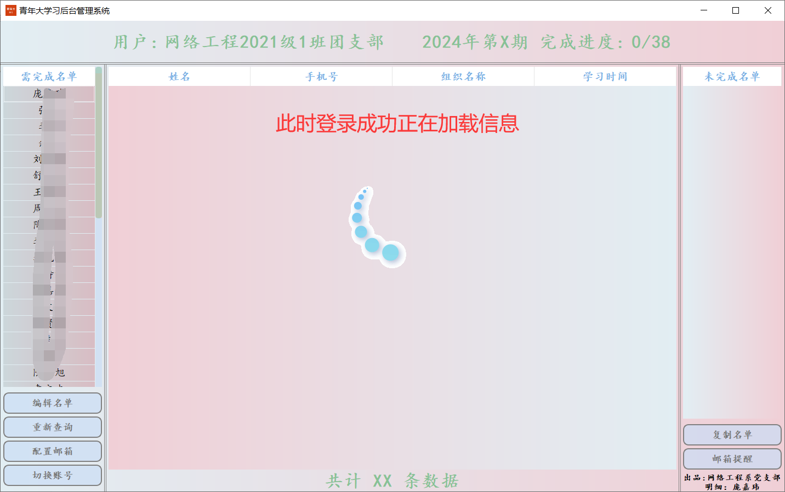

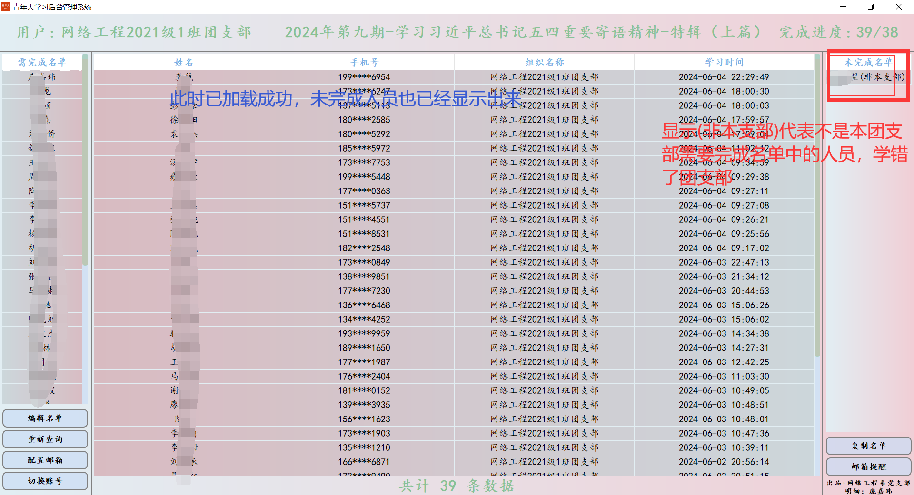

### 团支书-功能介绍

#### ①编辑名单

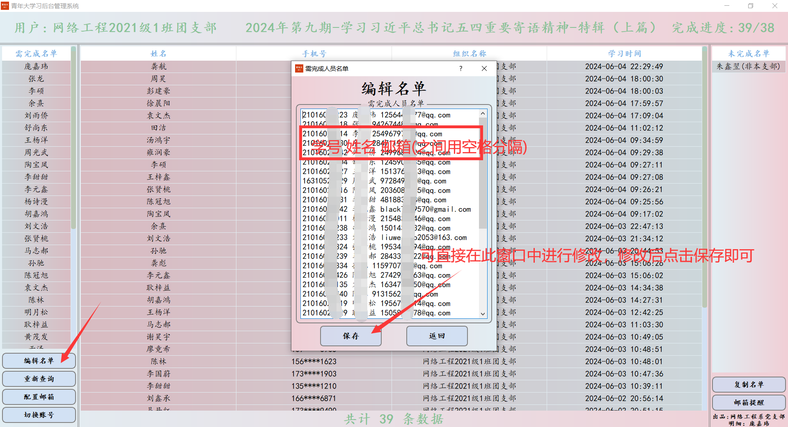

#### ②重新查询就是重新查询就不多解释了

#### ③配置邮箱

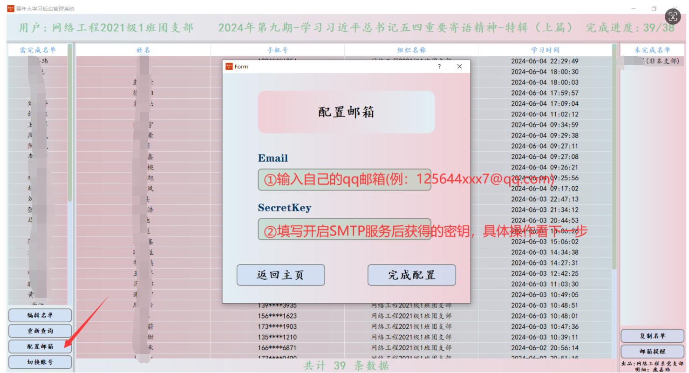

登录自己qq邮箱 [这里跳转登录qq邮箱](https://mail.qq.com/)

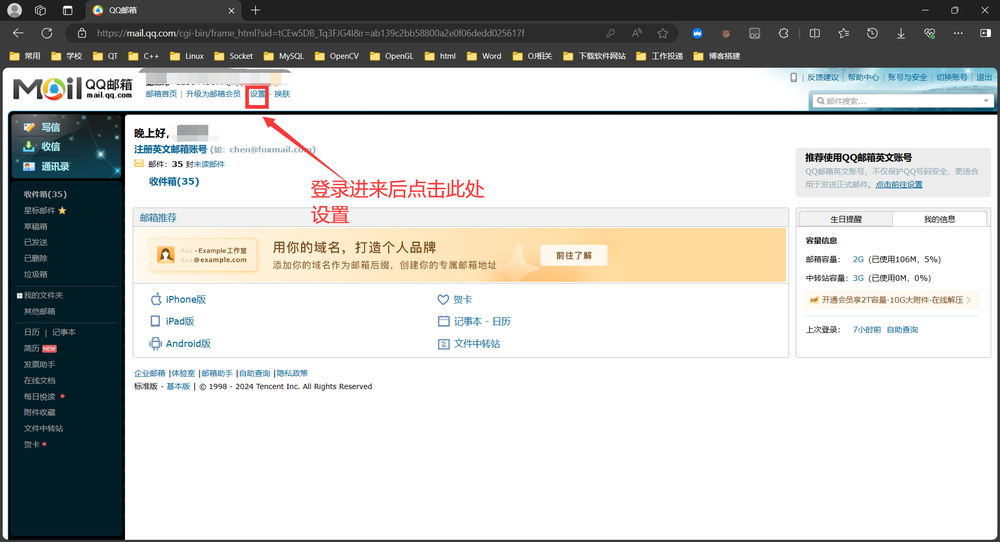

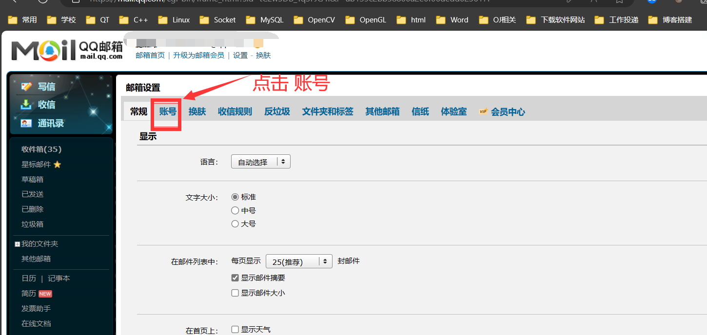

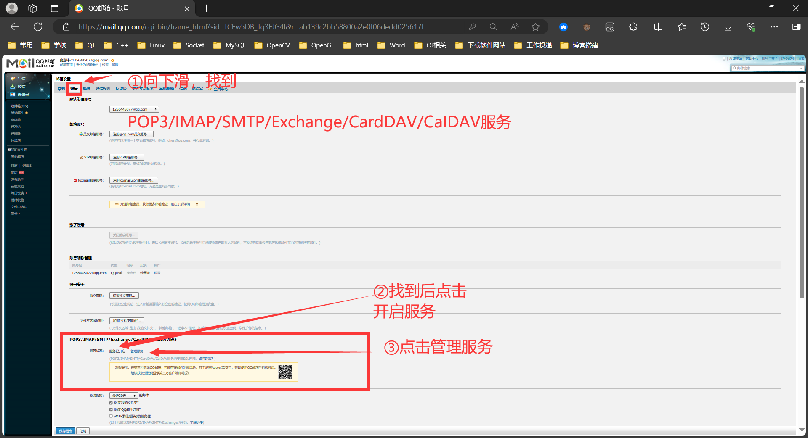

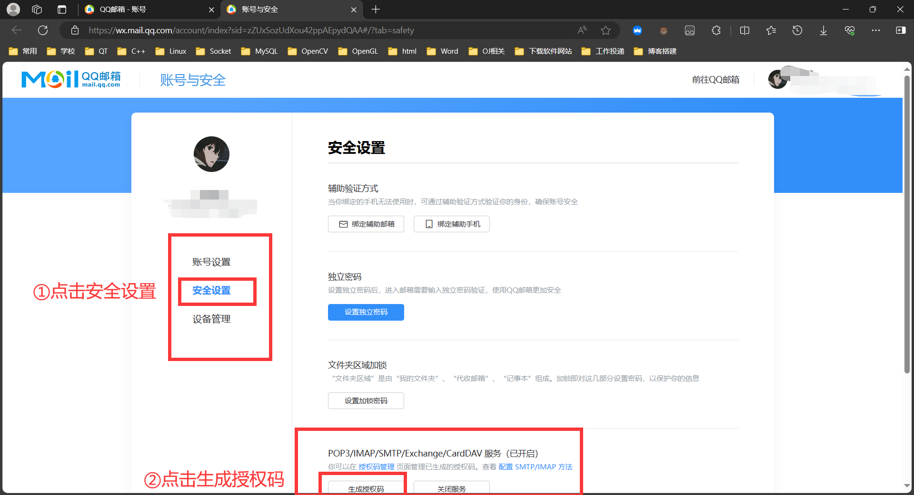

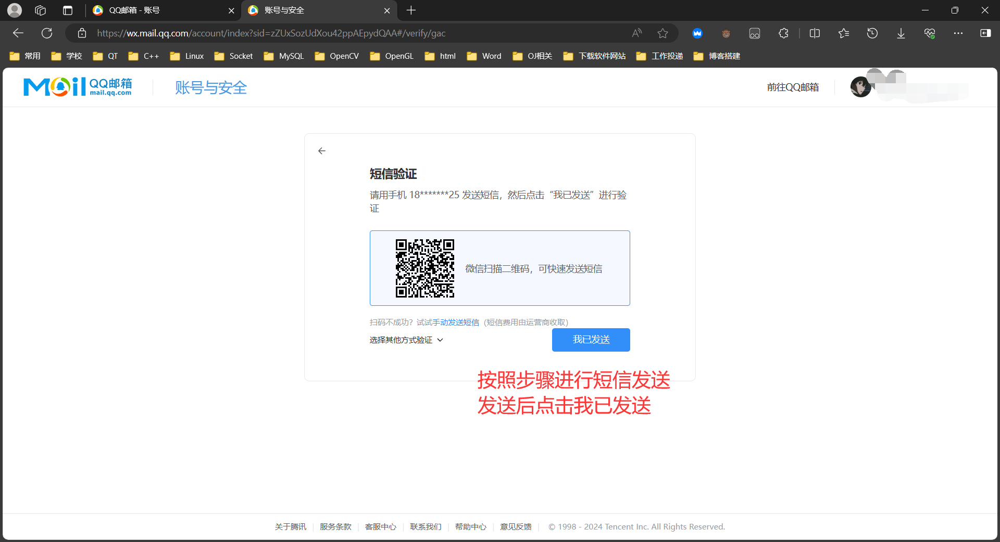

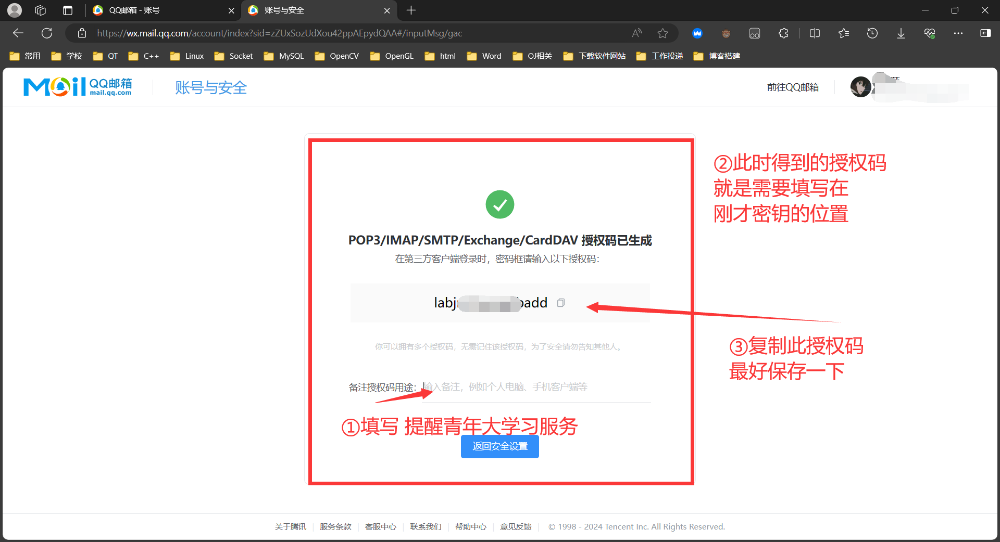

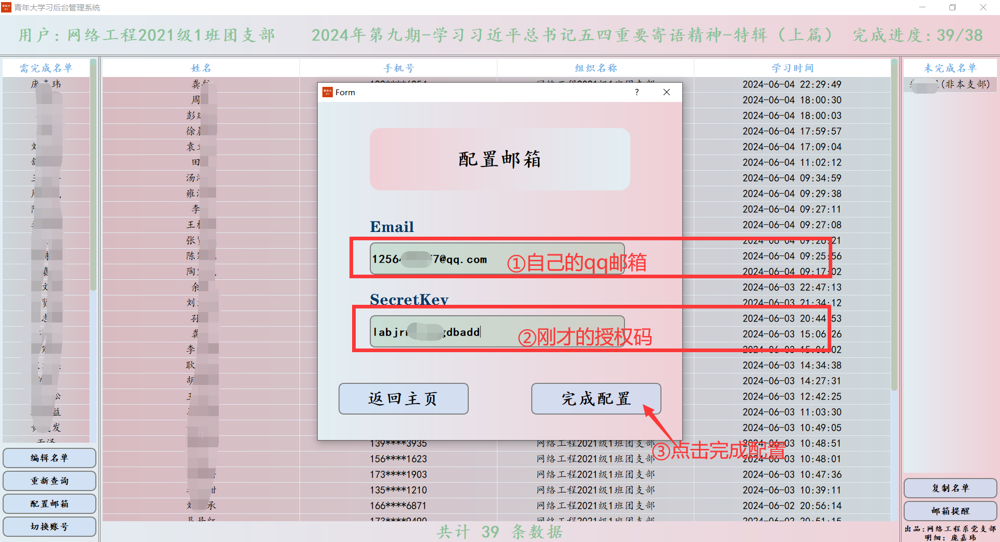

#### ④邮箱提醒

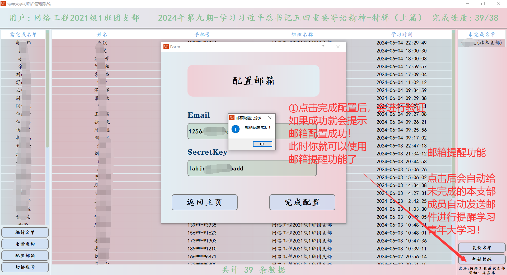

#### ⑤复制名单也就不多解释了

#### ⑥切换账号也就不多解释了

